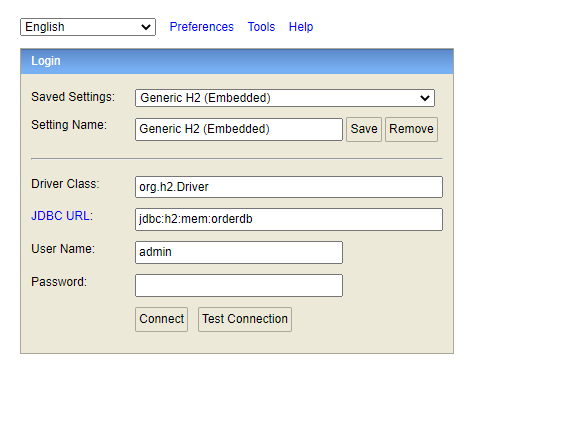
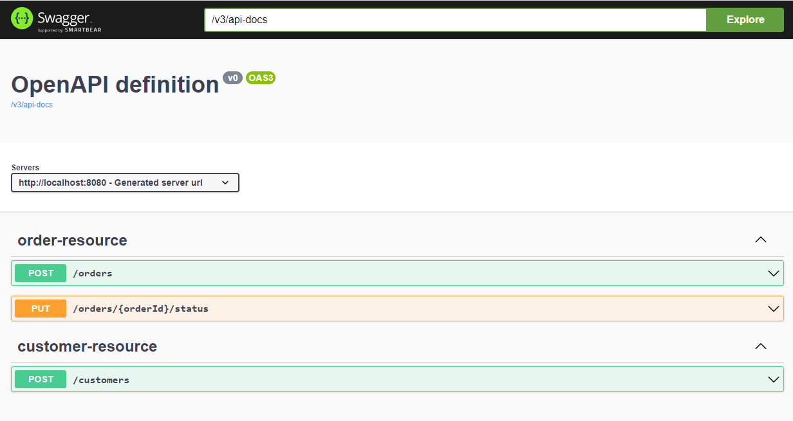
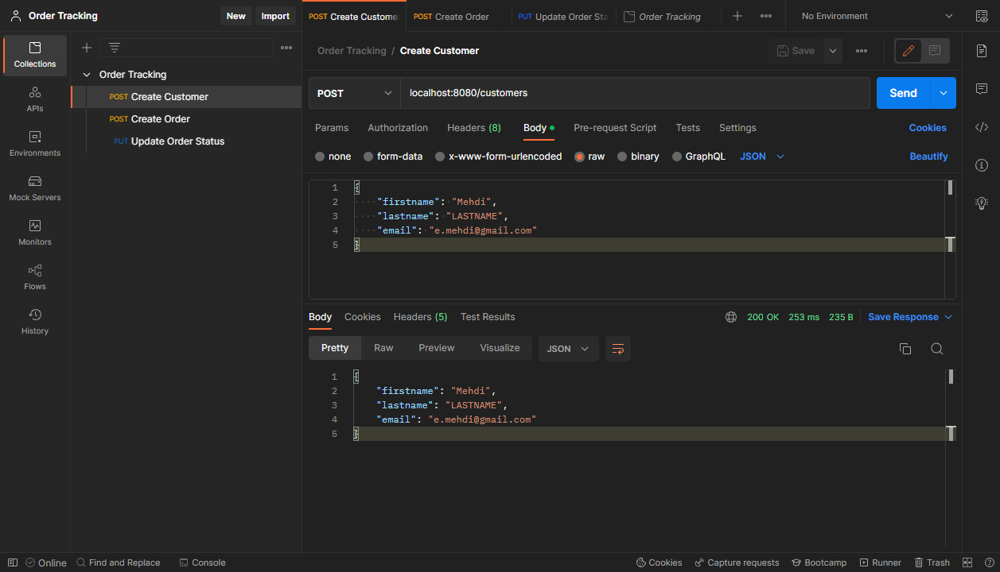
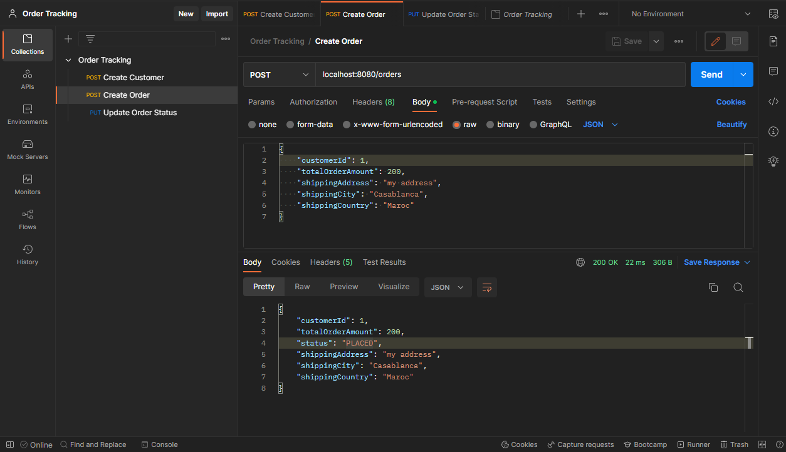
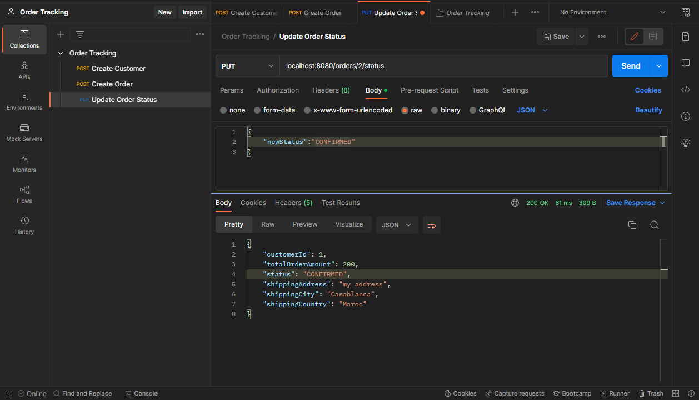
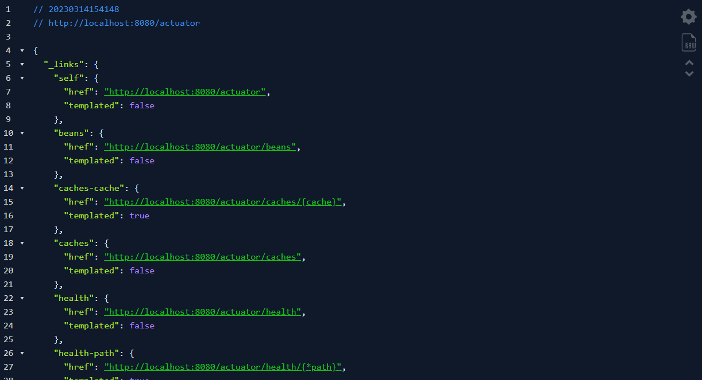

# Order tracking

This repository contains a Spring Boot application that provides a RESTful API endpoint for creating and updating customer orders.

## Getting Started 
To clone the project to your machine, use the following command:

```bash
git clone https://github.com/ElAsrioui/Order-tracking.git
```

## Requirements
To build/run the application you need:

- [JDK 8](https://www.oracle.com/java/technologies/javase/javase8-archive-downloads.html)
- [MAVEN](https://maven.apache.org/)
- [FakeSMTP](http://nilhcem.com/FakeSMTP/)

## To run the application locally

There are several ways to run a Spring Boot application on your local machine. One way is to execute the main method in the Main class from your IDE.

Alternatively you can use the Spring Boot Maven command :

```mvn
mvn spring-boot:run
```

## H2 Database
After running the project you can access to orderdb in : 

password: admin

[http://localhost:8080/h2-console](http://localhost:8080/h2-console)



## Swagger 

After running the project you can access to the Swagger in : [http://localhost:8080/swagger-ui-custom.html](http://localhost:8080/swagger-ui-custom.html)



## Postman 

In [POSTMAN]() you click on Import button and click on Upload Files button, then select the Order Tracking.postman_collection.json file.

1. Create customer request: 



2. Create order request: 



3. Update order status:



## Actuator 

After running the project you can access to the Actuator in : [http://localhost:8080/actuator](http://localhost:8080/actuator)


